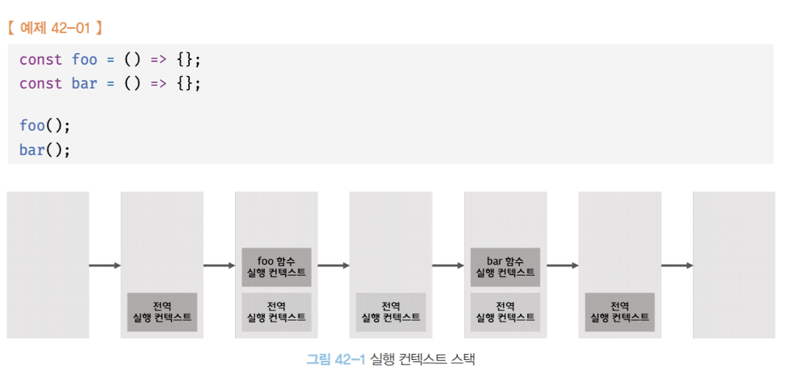

# Mechanism

자바스크립트가 어떻게 돌아가는지 매커니즘을 정리 해본다!

프로젝트 진행하면서 의문점이 생기다 정리할수도있고 코딩테스트 문제를 풀다가 정리할수도있다.

그리고 해당 정리는 모던자바스크립트 Deep Dive와 구글링으로 작성한다!

## 값의 할당

값의 할당에서 중요한 점중 하나는 **선언과 초기화가 무조건 나눠서 실행된다는 것**이고 **선언은 런타임 이전 초기화는 런타임 중 발생** 한다는 것이다.

그리고 두번째 중요한 점은 **선언을 하면 무조건 undefined**로 초기화한다는 점이다.

{: .undiefind로 할당하는 이유 }
undiefind로 할당하는 이유는 쓰려고하는 메모리 공간에 예상치 못한 값이 있을수 있기 때문에 undefined로 깔끔하게 초기화 하는 것이다.

그렇다면 재할당은 어떻게 이루어질까?

사실 재할당이나 초기화나 다 같은 방식으로 새로운 메모리를 찾고 이에 값을 할당한다. 그렇기 때문에 계속 재할당을 하면 메모리는 계속 낭비 될수 밖에 없다. 그래서 가비지 콜렉터로 이를 주기적으로 해결한다고 한다.

**중요한 점**

1. 선언 초기화는 무조건 나뉘어서 진행
2. 선언은 런타임 이전 초기화는 런타임중 진행
3. 선언하면 무조건 undefined로 초기화
4. 재할당을 하면 새로운 메모리를 찾아 값을 할당하기에 메모리는 계속 낭비되고 이를 적절한 타이밍에 가비지 콜렉터가 정리

---

## 데이터 타입

아래 총 6가지를 제외하면 자바스크립트 모든 타입은 객체 타입이다. 그래서 자바스크립트는 객체기반 언어이다!

### 숫자 타입

숫자 타입을 보면서 느낀건 C언어는 정수인지 소수인지 등 나눠서 int, double 등으로 처리를 했는데 **실수라면 모든 타입을 숫자 타입 하나로 정의**한다는 점이었다.

그리고 양의 무한대(infinity), 음의 무한대 (-infinity), 산술 연산 불가(NaN)도 숫자 타입으로 여긴다는 것이다.그리고 NaN을 표현할때는 대소문자 확실히 써주자 아니면 식별자로 인식한다.

### 문자열 타입

텍스트 데이터를 나타낼때 사용되며 일반적인 표기는 ('') 작은 따옴표로 감싸는 것정도로 정리하면 좋을거 같다.

템플릿 리터럴에서 알게된건 ``안에 있는 문자열은 띄어쓰기, 공백 등을 다 인식하고 출력한다는 것이다. 개꿀

그리고 코테 풀다가 다른 사람풀이를 봤는데 `'' + (숫자 타입)` 으로 사용해서 문자열로 간단히 바꾸는 것을 보았는데 +가 문자열을 연결할때 피연산자가 하나라도 문자열인 점을 이용하는 방법이라는 것도 확인할수있었다.

### 불리언 타입

일단 넘어가자

### undefined 타입과 null 타입

값의 할당 파트에서 선언하면 무조건 undefined로 초기화 된다는것을 살펴보았고 이는 자바스크립트가 초기화 되지 않은 변수라는 것을 알려주는 수단이 된다. 즉, 개발자가 의도적으로 빈값을 할당하지 않고 자바스크립트가 자동으로 할당했다라고 받아들일수있다.

개발자가 빈값이라고 정하고 싶을때는 null을 넣으면 된다.

**중요한 점**

1. undefined는 자바스크립트가 값이 없다고 알려주는것
2. null은 개발자가 값이 없다고 정해주는 것
3. 그리고 각각 하나의 값에 타입이다

### symbol 타입

사실 찾아보기 전에는 한번도 없는 타입이라 생소했다. 변경불가능한 원시타입이고 다른 값과는 중복이 되지않는다! 중복이 되지않는다가 매우 중요하다 그냥 유일무일한 식별자를 생성하고 싶다? 그러면 심볼을 사용해 만들어주면 된다.

```js
var key = Symbol("설명 : 이것은 키입니다"); //이런식으로 설명정도 붙여줄수있다.
console.log(typeof key); //symbol
```

## 원시타입, 객체타입

### 원시타입

원시타입은 변경 불가능한 값이며 읽기만 가능하다.

변수는 하지만 표면적으로는 값이 변경가능한것 처럼보인다. 하지만 이는 **참조하는 주소를 바꿈으로써 재할당을 하는 과정**이다.

그러니 원시타입 친구들은 무조건 다른 주소에 값을 쓰고 주소를 재할당 하는 방식으로 진행된다. -> 이렇게하면 데이터 값의 신뢰성이 올라가고 추적이 쉬워진다 :)

{: .note }
**문자열의 불변성** : 알고리즘 문제를 풀다가 공부하게 되었다. 문자열도 원시타입이다. 그러니 문자열 타입은 변경 불가능하다. 그렇기 때문에 문자열을 다른 문자열로 바꾸는 행위도 재할당이다. 근데 문자열은 **유사배열객체** 라서 배열처럼 접근이 가능하다. 하지만 불변성을 지니기때문에 인덱스로 해당 인덱스에 해당하는 문자를 다른 문자로 변경은 불가능하다. 불변성을 지닌 원시타입이고 배열처럼 접근가능하다고 알아놓으면 좋을거같다.

### 객체타입

{: .warning }
나중에 채우자!

## 배열인척 하는 쟈스 배열

언젠가 자바스크립트 배열이 배열이 아니다라는 말을 들은적이 있는거 같은데 흠 알아보자

일단 배열은 객체다 근데 좀다르다

| 구분            | 객체             | 배열 객체     |
| :-------------- | :--------------- | :------------ |
| 구조            | 프로퍼티 키와 값 | 인덱스와 요소 |
| 값의 참조       | 프로퍼티 키      | 인덱스        |
| 값의 순서       | x                | o             |
| length 프로퍼티 | x                | o             |

요정도 차이점이 존재한다.

원래 배열은 타입이 다같은 요소들이 빈틈없이 나열된 자료구조를 의미한다. 흔히 C언어에서 보던 배열이 이에 해당한다. 그리고 값접근을 O(1)에 할수있다.

그렇다면 자바스크립트의 배열은? 배열인 척하는 특수한 객체!

인덱스가 프로퍼티 키이며 요소가 프로퍼티 값으로 설정되어있는 객체이다. 그래서 프로퍼티 값의 타입은 어떤 것이든 가능하다.

생각해보면 이는 장단점을 가진다. 원래 기존 배열은 탐색은 쉽지만 삽입 및 삭제는 시간복잡도가 쟈스의 시간 복잡도보다 오래 걸린다. 하지만 객체로 이루어진 쟈스 배열은 반대의 특성을 지닌다.

{: .note }
쟈스 배열은 탐색이 객체이기 때문에 기존 배열보다 상대적으로 느리지만 좀더 빨리 배열처럼 작동하도록 하기위해 최적화를 많이 시켜놔서 일반 쟈스 객체보다는 빠르다!

{: .note }
쟈스의 자율성이 문제를 일으키는 희소배열, 값이 없는데 연속적이지 않은 배열을 만들어 내는 것을 말한다. 이러한 희소배열을 만들지 않도록 하자 (생기면 예측 불가능한 일이 생긴다.) => 배열은 같은 타입의 요소를 연속적으로 위치시키는 것이 최선이라는 것을 잊지 말자

## 비동기 프로그래밍

함수는 실행 컨텍스트 스택 일명 콜스택이라고 하는곳에 쌓이고 실행되고 다음거 푸쉬되고 이런식으로 함수를 차례로 실행하게된다

\

> 자바스크립트 엔진은 단 하나의 실행컨텍스트 스택을 갖는다

하나의 실행컨텍스트스택 만을 갖는다는 의미는 즉, 한번에 단 하나만의 일이 가능하다는 거고 싱글 스레드 방식으로 작동한다는 것을 의미한다.

하나의 일만 가능하다면 이는 앞선 태스크 A가 3초가 걸린다면 뒤의 태스크 B는 3초 후에 일어난다는 것을 말한다. 이렇게 무조건 순차적으로 일어나는 것을 `동기` 라고 한다.

이와 반대되는 개념인 `비동기`는 앞선 태스크A가 3초가 걸리는것을 비동기 처리를 해버리면 뒤의 태스트B가 앞선 태스크를 기다리지않고 바로 실행되고 태스트 A는 3초가 되면 실행된다.

동기와 비동기는 실행순서의 보장과 블로킹의 트레이드 오프가 일어난다.

비동기 처리를 위해 콜백 패턴을 전통적으로 썻지만 이는 여러가지 문제가 있다.

- 가독성 떨어짐
- 예외처리 곤란함
- 비동기 처리 한번에 하기 어려움

ES6는 비동기 처리를 위해 프로미스를 도입함

## 🚧🚧 Promise 🚧🚧


