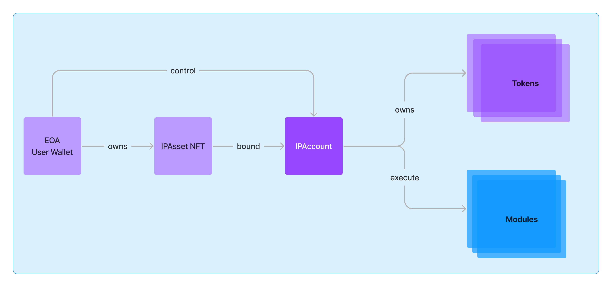

# Story Protocol

저작권.,...레이어1! 아이피를 프로그래밍 가능!

## Table Of Contents

- [IP Asset](#ip-asset)
- [IP Account](#ip-account)
- [Module](#module)
- [Registry](#registry)
- [Programmable IP License](#programmable-ip-license)

## Concepts

### 🧩 IP Asset

그냥 말그대로 IP 이다. 짱구를 IP로 등록하고 싶다면 대표 NFT 발행하고 이를 등록하면 IP Asset이 된다.

**조금 더 자세히**

예시 정도 보면 메타데이터 이해 쌉가능

해리포터에 대한 IP Asset 메타데이터 Standard

```json
{
  "title": "Harry Potter and the Philosopher's Stone",
  "image": "link_to_book_cover",
  "dateCreatedISO8601": "1997-06-26T00:00:00", // June 26 1997
  "ipType": "literature",
  "creators": [
    {
      "name": "JK Rowling",
      "description": "Author",
      "socialMedia": [
        {
          "platform": "Wikipedia",
          "url": "https://en.wikipedia.org/wiki/J._K._Rowling"
        }
      ]
    },
    {
      "name": "Thomas Taylor",
      "description": "Illustrator"
    },
    {
      "name": "Bloomsbury Publishing",
      "description": "Publisher",
      "socialMedia": [
        {
          "platform": "Website",
          "url": "https://www.bloomsbury.com/"
        }
      ]
    }
  ],
  "media": [
    {
      "name": "ePub",
      "uri": "link_to_epub",
      "mimeType": "application/epub+zip"
    },
    {
      "name": "Book Summary PDF",
      "uri": "link_to_book_summary_pdf",
      "mimeType": "application/pdf"
    }
  ],
  "attributes": [
    {
      "key": "ISBN",
      "value": "978-0-7475-3269-0"
    },
    {
      "key": "Genre",
      "value": "Fantasy"
    }
  ]
}
```

### ⚙️ IP Account

IP Asset 연결된 스마트 컨트랙트!

- IP Asset의 데이터(라이선스 토큰, 로열티 토큰, 소유권 세부 정보 등)를 저장한다. -> 즉, 재료를 저장한다.
- 다양한 모듈에서 해당 데이터를 사용할수있도록 지원 (라이선싱, 수익/로열티 공유 등등) -> 프로그래밍 가능하기 때문에 더 다양한 작업 가능 -> 즉, 재료를 활용해 다양한 모듈을 가지고 기능을 수행
- 6551을 수정한 어��운트



**조금 더 자세히**

모든 것의 기초가 되는 NFT가 이전되면 자동으로 IP Asset과 IP Account 모두 이전됨

### 🧱 Module

IP Account의 기능 을 확장 할수있는 스마트 컨트랙트 모듈

**핵심 모듈 3가지**
📜 라이선스 모듈
💸 로열티 모듈
❌ 분쟁 모듈

**조금 더 자세히**

[module interface](https://github.com/storyprotocol/protocol-core-v1/blob/main/contracts/interfaces/modules/base/IModule.sol)

위의 인터페이스를 준수하는 독립형 계약 모듈

### 🗂️ Registry

전역적으로 관리하는 디렉토리 스토리지 역할~ IP Account 보다는 더 큰 개념

### 💊 Programmable IP License (PIL)

실제 오프체인 법적 계약 이고 이걸 온체인 IP Asset에 첨부가능

## Module 살펴보기

### ⛏️ Base 모듈

모든 모듈에 대한 기본 기능을 담고 있음

```js
// SPDX-License-Identifier: BUSL-1.1
pragma solidity 0.8.26;

import { IERC165, ERC165 } from "@openzeppelin/contracts/utils/introspection/ERC165.sol";
import { IModule } from "../interfaces/modules/base/IModule.sol";

/// @title BaseModule
/// @notice Base implementation for all modules in Story Protocol.
abstract contract BaseModule is ERC165, IModule {
    /// @notice IERC165 interface support.
    function supportsInterface(bytes4 interfaceId) public view virtual override(ERC165, IERC165) returns (bool) {
        return interfaceId == type(IModule).interfaceId || super.supportsInterface(interfaceId);
    }
}
```

ERC165, IModule 을 상속받는다

ERC165는 다른 컨트랙트가 특정 인터페이스를 지원하는지 체크할수있게 해준다.

interdaceId가 Imodule의 인터페이스 ID와 일치하는 경우 true를 반환한다. 만약 그렇지 않으면 ERC165의 supportsInterface 함수를 호출하여 다른 인터페이스 지원 여부를 확인하게된다.

### 📜 라이선스 모듈

IPAsset에 라이센스 모듈을 사용하면 해당 라이센스 조건에 따라 다른 사람이 사용하는 걸 제한할수있음
