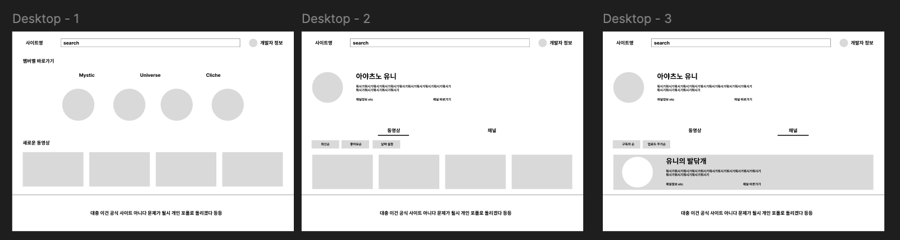

# 스텔라이브 키리누키 사이트

## 2024_08_10

우선 키리누키 사이트를 만들기 위해 첫번째로 해야할일은 목표를 설정하는 것이었다.

이 프로젝트를 기획한 이유는 아래와 같았다.

1. 너무 많은 키리누키 채널들을 일일히 찾지 않도록 모으자

2. 나의 최애를 모아보자

그래서 다음과 같이 목표를 잡고 진행하기로 했다.

{: .important }
**🎯 목표** : 유튜브에 있는 모든 스텔라이브 키리누키 채널을 쉽게 모아서 볼수있는 웹사이트

그렇다면 기능은 무엇이 필요할까?

**주요기능**

- 모든 키리누키 채널을 모으는 기능
- 해당 영상이 어떤 스텔라이브 멤버인지 확인하고 분류하는 기능

**서브기능**

- 최신 업데이트 영상 알림 기능
- 좋아요, 날짜 등 정렬하는 기능

우선은 이정도 기능만 구현하고 추후 발전 시켜보자

작업시작하기 전 TO DO 리스트 작성도 대략 해보자

TO-DO List

1. ~~기능 생각해보기~~
   {: .d-inline-block }
   완료 {: .label .label-green }

2. 유튜브 키 발급 받기
3. 유튜브 api 살펴보기
4. 기능 명세서 작성
5. 와이어 프레임 제작
6. ui 제작
7. 백엔드 문서 작성
8. 프론트엔드 문서 작성
9. 백엔드 api 완성 시키기
10. 프론트엔드 짬짬히 완성

### 유튜브 API 살펴보기

유튜브에서는 개발자에게 유튜브 API를 제공한다,
[유튜브 API docs 바로가기!](https://developers.google.com/youtube/v3/getting-started?hl=ko#%EC%98%88-2){: .btn }

[유튜브 API 사용해보기!](https://developers.google.com/youtube/v3/docs/channels/list?apix=true&hl=ko&apix_params=%7B%22part%22%3A%5B%22snippet%2CcontentDetails%2Cstatistics%22%5D%2C%22forHandle%22%3A%22%40user-nm1id1hr8f%22%7D){: .btn }

키를 발급 받고 사용하면 되는데 우선 키를 받기 전 내가 구현하고 싶은 기능들을 구현 가능한지 체크하고 넘어가자

**채널 정보 받아오기**

```http
GET https://youtube.googleapis.com/youtube/v3/channels?part=snippet%2CcontentDetails%2Cstatistics&forHandle=%40user-nm1id1hr8f&key=[YOUR_API_KEY] HTTP/1.1

Authorization: Bearer [YOUR_ACCESS_TOKEN]
Accept: application/json
```

```json
{
  "kind": "youtube#channelListResponse",
  "etag": "q8-FfK-xVBO8g8cgIday2IuE7rg",
  "pageInfo": {
    "totalResults": 1,
    "resultsPerPage": 5
  },
  "items": [
    {
      "kind": "youtube#channel",
      "etag": "gk9nYBqrRrBvvptWJpNt5iIn0Us",
      "id": "UCSkxf8rEikMXb5Bgc92u_lQ",
      "snippet": {
        "title": "유니 발닦개",
        "description": "스텔라이브 \"팬페이지\"  입니다.  \n\n피드백 및 불만사항등등 : djdejd235@gmail.com \n",
        "customUrl": "@user-nm1id1hr8f",
        "publishedAt": "2022-01-22T18:05:04.398155Z",
        "thumbnails": {
          "default": {
            "url": "https://yt3.ggpht.com/BuTK3zR07vGMcjGDf4J12g1QZEAGf_hti7Q4O4vSpCY5z4eOGQgV1_7viGm-Q5VUmxGLGelKa_0=s88-c-k-c0x00ffffff-no-rj",
            "width": 88,
            "height": 88
          },
          "medium": {
            "url": "https://yt3.ggpht.com/BuTK3zR07vGMcjGDf4J12g1QZEAGf_hti7Q4O4vSpCY5z4eOGQgV1_7viGm-Q5VUmxGLGelKa_0=s240-c-k-c0x00ffffff-no-rj",
            "width": 240,
            "height": 240
          },
          "high": {
            "url": "https://yt3.ggpht.com/BuTK3zR07vGMcjGDf4J12g1QZEAGf_hti7Q4O4vSpCY5z4eOGQgV1_7viGm-Q5VUmxGLGelKa_0=s800-c-k-c0x00ffffff-no-rj",
            "width": 800,
            "height": 800
          }
        },
        "localized": {
          "title": "유니 발닦개",
          "description": "스텔라이브 \"팬페이지\"  입니다.  \n\n피드백 및 불만사항등등 : djdejd235@gmail.com \n"
        },
        "country": "KR"
      },
      "contentDetails": {
        "relatedPlaylists": {
          "likes": "",
          "uploads": "UUSkxf8rEikMXb5Bgc92u_lQ"
        }
      },
      "statistics": {
        "viewCount": "22726713",
        "subscriberCount": "18900",
        "hiddenSubscriberCount": false,
        "videoCount": "949"
      }
    }
  ]
}
```

채널 정보는 위와같이 가져올수 있다. 필요한 정보는 다가져오는거 같다. (채널대상! ㅣ 유니 발닦개님)

**동영상 정보 받아오기**

```http
GET https://youtube.googleapis.com/youtube/v3/videos?part=snippet%2CcontentDetails%2Cstatistics&id=qcvgxgfnp9E&key=[YOUR_API_KEY] HTTP/1.1

Authorization: Bearer [YOUR_ACCESS_TOKEN]
Accept: application/json
```

```json
{
  "kind": "youtube#videoListResponse",
  "etag": "GU7u4tga6TzbOOslClg1N3ROK-Q",
  "items": [
    {
      "kind": "youtube#video",
      "etag": "N2xP9qsfKDVOw-ZuPei1ch0Fl58",
      "id": "qcvgxgfnp9E",
      "snippet": {
        "publishedAt": "2024-03-22T14:06:59Z",
        "channelId": "UCSkxf8rEikMXb5Bgc92u_lQ",
        "title": "ai도파 - 씨유어게인 히나 반응",
        "description": "수익창출xx\n치지직꾸\n[칸나]\n▶https://chzzk.naver.com/f722959d1b8e651bd56209b343932c01\n[유니]\n▶https://chzzk.naver.com/45e71a76e949e16a34764deb962f9d9f\n[히나] \n▶https://chzzk.naver.com/b044e3a3b9259246bc92e863e7d3f3b8\n[마시로] \n▶https://chzzk.naver.com/4515b179f86b67b4981e16190817c580\n[리제]\n▶https://chzzk.naver.com/4325b1d5bbc321fad3042306646e2e50\n[타비]\n▶https://chzzk.naver.com/a6c4ddb09cdb160478996007bff35296\n\n시라유키 히나\n\n유튜브 :https://www.youtube.com/@shirayukihina \n다시보기 : https://www.youtube.com/@hinareplay/featured  \n트위터 : https://twitter.com/Shirayukihina_\n\n#버튜버 #히나   #vtuber #스텔라이브",
        "thumbnails": {
          "default": {
            "url": "https://i.ytimg.com/vi/qcvgxgfnp9E/default.jpg",
            "width": 120,
            "height": 90
          },
          "medium": {
            "url": "https://i.ytimg.com/vi/qcvgxgfnp9E/mqdefault.jpg",
            "width": 320,
            "height": 180
          },
          "high": {
            "url": "https://i.ytimg.com/vi/qcvgxgfnp9E/hqdefault.jpg",
            "width": 480,
            "height": 360
          },
          "standard": {
            "url": "https://i.ytimg.com/vi/qcvgxgfnp9E/sddefault.jpg",
            "width": 640,
            "height": 480
          },
          "maxres": {
            "url": "https://i.ytimg.com/vi/qcvgxgfnp9E/maxresdefault.jpg",
            "width": 1280,
            "height": 720
          }
        },
        "channelTitle": "유니 발닦개",
        "tags": [
          "버튜버",
          "vtuber",
          "Vtuber",
          "브이튜버",
          "이세계아이돌",
          "이세돌",
          "우왁굳",
          "한동숙",
          "홀로라이브",
          "니지산지",
          "사쿠라미코",
          "미코",
          "스이세이",
          "페코라",
          "노엘",
          "호쇼마린",
          "라플라스",
          "클로에",
          "코보",
          "칼리오페",
          "가우르구라",
          "왓슨",
          "아멜리아",
          "랄로",
          "파카",
          "도파",
          "미야고",
          "트위치",
          "일본",
          "수박게임",
          "스텔라이브",
          "칸나",
          "히나",
          "유니",
          "강지",
          "시로",
          "리제",
          "타비",
          "아이리칸나",
          "아야츠노유니",
          "시라유키히나",
          "네네코마시로",
          "아카네리제",
          "아라하시타비",
          "버튜",
          "랄로히나",
          "히나랄로"
        ],
        "categoryId": "24",
        "liveBroadcastContent": "none",
        "localized": {
          "title": "ai도파 - 씨유어게인 히나 반응",
          "description": "수익창출xx\n치지직꾸\n[칸나]\n▶https://chzzk.naver.com/f722959d1b8e651bd56209b343932c01\n[유니]\n▶https://chzzk.naver.com/45e71a76e949e16a34764deb962f9d9f\n[히나] \n▶https://chzzk.naver.com/b044e3a3b9259246bc92e863e7d3f3b8\n[마시로] \n▶https://chzzk.naver.com/4515b179f86b67b4981e16190817c580\n[리제]\n▶https://chzzk.naver.com/4325b1d5bbc321fad3042306646e2e50\n[타비]\n▶https://chzzk.naver.com/a6c4ddb09cdb160478996007bff35296\n\n시라유키 히나\n\n유튜브 :https://www.youtube.com/@shirayukihina \n다시보기 : https://www.youtube.com/@hinareplay/featured  \n트위터 : https://twitter.com/Shirayukihina_\n\n#버튜버 #히나   #vtuber #스텔라이브"
        },
        "defaultAudioLanguage": "ko"
      },
      "contentDetails": {
        "duration": "PT4M14S",
        "dimension": "2d",
        "definition": "hd",
        "caption": "false",
        "licensedContent": false,
        "regionRestriction": {
          "blocked": ["BY", "RU"]
        },
        "contentRating": {},
        "projection": "rectangular"
      },
      "statistics": {
        "viewCount": "138883",
        "likeCount": "1167",
        "favoriteCount": "0",
        "commentCount": "162"
      }
    }
  ],
  "pageInfo": {
    "totalResults": 1,
    "resultsPerPage": 1
  }
}
```

동영상 정보 또한 잘 받아온다 (근데 태그 겁나 많다...)

## 2024_08_11

기본적인 정보들은 잘받아오고 이를 파싱해서 화면에 뿌려 주는건 쿤문제가 안될거같았다. 근데 살펴보다가 할당량이라는 개념이 있는데 이게 10000으로 제한되어있다. 근데 뭐 추가하거나 이런부분은 없기 때문에 문제가 없을거라 생각은 된다. 왜냐하면 읽기 리소스가 보통 1인데 내가 만들 프로젝트는 유튜브에서 단지 read 만 할것이기 때문이다. (그럼에도 내 앱이 할당량으로 인해 문제가 생기면 그때 가서 생각해보려고한다. 그러면 행복사할듯)

그리고 좋은점은 언어별 라이브러리를 제공한다. 나는 자바스크립트 즉, node.js 로 개발을 할것이기 때문에 잘 사용하면 좋을거같다.

## 2024_08_26

한동안 작성을 못했는데 세부 기능 및 와이어프레임을 대충 생각해보자



