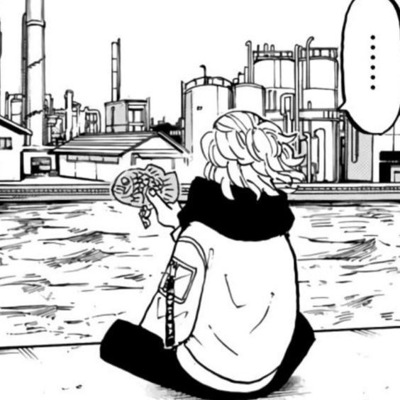

# React


아직은 잘나가는 웹프레임워크

## Re-rendering

**리렌더링이 되는 시점**

- 자신의 state가 변경될 때
- 부모 컴포넌트로부터 받아오는 props가 변경될 때
- 부모 컴포넌트가 리렌더링(re-rendering)될 때
- foreceUpdate 함수가 실행될 때 -> 강제로 다시 리렌더링 하는 함수

## 2024_09_20

### 🚧🚧 useRef 🚧🚧 사용법 부터 keep going 해야함

🚧 ...작성중... 🚧
{: .label .label-yellow }

[react useRef](https://ko.react.dev/reference/react/useRef#useref)

"렌더링에 필요하지 않은 값을 참조할수있는 react hook" 이라고 나와 공식문서에 나와있다 의미가 뭘까 알아보자

```tsx
import { useRef } from "react";

function MyComponent() {
  const intervalRef = useRef(0);
  const inputRef = useRef(null);
  // ...
}
```

**매개변수**

- initialValue : ref 객체의 current 프로퍼티 초기 설정값이다.

**return값 (단일 프로퍼티를 가진 객체를 반환)**

- current : initialValue로 설정한 값이 초기값으로 들어온다 useState와 비슷하다고 보면 된다. 그리고 특이한건 ref객체를 jsx 노드의 ref 어트리뷰트로 던져주게되면 current를 해당 돔으로 설정한다. 돔자체를 참조하게된다. 📌 다음 렌더링에서 useRef는 동일한 객체를 반환한다는 사실이 중요하다.

📌 렌더링에 사용되는 애들을 조작할려면 useRef는 적합하지 않음
📌 react는 useRef가 바뀌는지 알수없기 땨문에 렌더링 안함
📌 ref.current는 렌더링 중에 쓰거나 읽지 말자
📌 ref 객체도 두 번 생성되지만, 결국 하나만 사용되므로 걱정말라 strict mode 때문임~

**사용법**

```js
import { useRef } from "react";

function Stopwatch() {
  const intervalRef = useRef(0);
  // ...
}
```

위와 같이 선언하면 current 프로퍼티에 초기값 (0)이 있는 ref 객체를 반환한다 아까도 말했듯이 값을 변경해도 리렌더링은 일어나지 않고 계속 값을 들고 있는다. 값변경은 current에 직접 접근하여 바꿀 수 있다.

**중요한 점**

- 리렌더링 사이에 정보를 저장할수있다. -> 그냥 변수는 리렌더링하면 날아가니까!
- 변경해도 리렌더링은 촉발되지않는다. -> state는 리렌더링 촉발 시키니까!
- 각각 컴포넌트에 로컬로 저장된다. -> 외부변수는 정보공유가 되지만 ref는 로컬로 저장된다.

## 2024_09_21

### useOutletContext

React-Router
{: .label .label-yellow }

outlet에 설정된 컴포넌트에게 props를 내려주기 위한 hook이다.

```js
function Parent() {
  const [count, setCount] = React.useState(0);
  return <Outlet context={[count, setCount]} />;
}
```

```js
import { useOutletContext } from "react-router-dom";

function Child() {
  const [count, setCount] = useOutletContext();
  const increment = () => setCount((c) => c + 1);
  return <button onClick={increment}>{count}</button>;
}
```

사실 사용방법은 간단하다 context로 내려주고 이를 useOutletContext를 통해 받으면 된다.

## 2024_09_29

### 컴포넌트 순수하게 유지하기


[soonsu](https://ko.react.dev/learn/keeping-components-pure)

useRef보다가 `순수`라는 말이 나오고 순수함수 라는 말이 나오길래 공식 docs 보면서 정리를 좀했다.

**순수함수란?**

- 자신의 일에 집중하는 함수 -> 함수를 호출하기 전에 존재했던 객체 변수를 변화 시키지 않는다.
- 같은 입력, 같은 출력 -> 같은 입력에는 같은 출력을 뱉는다.

공식독스에서는 y=2x같은 식에서 같은 x를 넣으면 항상 같은 y를 뱉는다고 예시를 들고 있고 변하는 예는 주식 시장환경에 따라 변동되는 것과 같은 문제를 예시로 들고있다.

**React**는 이러한 순수함수 컨셉으로 설계되었다고 한다. 그렇기 때문에 React는 모든 컴포넌트가 순수함수일거라고 생각한다고 한다.

이게 무슨이야기 이냐~

React 컴포넌트에 같은 입력이 주어진다면 반드시 같은 jsx를 반환한다는 것을 의미한다.

```jsx
function Recipe({ drinkers }) {
  return (
    <ol>
      <li>Boil {drinkers} cups of water.</li>
      <li>
        Add {drinkers} spoons of tea and {0.5 * drinkers} spoons of spice.
      </li>
      <li>Add {0.5 * drinkers} cups of milk to boil and sugar to taste.</li>
    </ol>
  );
}

export default function App() {
  return (
    <section>
      <h1>Spiced Chai Recipe</h1>
      <h2>For two</h2>
      <Recipe drinkers={2} />
      <h2>For a gathering</h2>
      <Recipe drinkers={4} />
    </section>
  );
}
```


_출력 결과_

보면 2를 props로 주면 2 cups of water를 포함한 jsx를 반환하며
4를 주면 4 cups of water를 포함한 JSX를 반환한다.

그럼 위반하는 녀석은?

**사이트 이펙트**

```jsx
let guest = 0;

function Cup() {
  // 나쁜 지점: 이미 존재했던 변수를 변경하고 있다!
  guest = guest + 1;
  return <h2>Tea cup for guest #{guest}</h2>;
}

export default function TeaSet() {
  return (
    <>
      <Cup />
      <Cup />
      <Cup />
    </>
  );
}
```

위 컴포넌트는 분명 <Cup /> 컴포넌트를 동일하게 3번 출력하는데 아래와 같이 동일한 ui가 안그려지는걸 볼수있다. 또한 하나더 짚어보면 렌더링 순서에 영향받는 모습을 볼수있다.


_출력 결과_

이는 생각치도 못한 버그를 만들수 있다... 올바르게 만든다면 아래와 같아진다.

```jsx
function Cup({ guest }) {
  return <h2>Tea cup for guest #{guest}</h2>;
}

export default function TeaSet() {
  return (
    <>
      <Cup guest={1} />
      <Cup guest={2} />
      <Cup guest={3} />
    </>
```

이제 컴포넌트가 순수해졌다 😃

**지역 변형**

```jsx
function Cup({ guest }) {
  return <h2>Tea cup for guest #{guest}</h2>;
}

export default function TeaGathering() {
  let cups = [];
  for (let i = 1; i <= 12; i++) {
    cups.push(<Cup key={i} guest={i} />);
  }
  return cups;
}
```

바깥에서 cups 변수가 TeaGathering바깥에서 생성되었다면 문제가 되지만 이는 동일한 렌더링 중에 변수를 변경하는 것은 전혀 문제가 없다 해당 지역 즉, 스코프안에서만 변형이 일어나기 때문에 다른 컴포넌트는 해당 작업들로 인해 전혀 문제를 겪지않는다.

**부작용을 일으킬 수있는 지점**
하지만... 생각해보면 우리는 컴포넌트내에서 이벤트 핸들러를 통해 변화를 일으킨다. 근데 이것은 렌더링중에 발생하는것이 아니기 때문에 다른 문제라고 한다. 이벤트핸들러가 컴포넌트 내부에 정의되었어도 렌더링중에는 실행되지않기 때문에 순수성이 유지된다고 본다. 그렇기 때문에 우리가 흔히 사용하는 onClick 같은 것들은 순수 할필요가 없다고 한다. (마땅하게 이벤트 핸들러로 변경시킬수없다면 useEffect 가 있지만 최후의 수단이다.)

{: .note-title }

> 리액트가 순수함을 신경쓰는 이유
>
> ✅ 동일한 입력에 동일한 출력을 뱉기 때문에 하나의 컴포넌트가 재사용가능!
> ✅ 입력이 변경되지않으면 렌더링을 하지않고 넘기기 때문에 성능 향상
> ✅ 또한 순수하기 때문에 연산을 중단을 안전하게 언제든지 할수 있음
> 순수하게 유지하면 할수록 개이득임!

> ##🚧🚧🚧🚧🚧🚧🚧🚧🚧🚧작성해야하는 녀석들🚧🚧🚧🚧🚧🚧🚧🚧🚧🚧

<!-- ## Hook🔴🔴🔴🔴🔴🔴🔴🔴🔴🔴🔴🔴🔴

### useMemo🔴🔴🔴🔴🔴🔴🔴🔴🔴🔴🔴🔴🔴

### Suspense 🔴🔴🔴🔴🔴🔴🔴🔴🔴🔴🔴🔴🔴 -->
